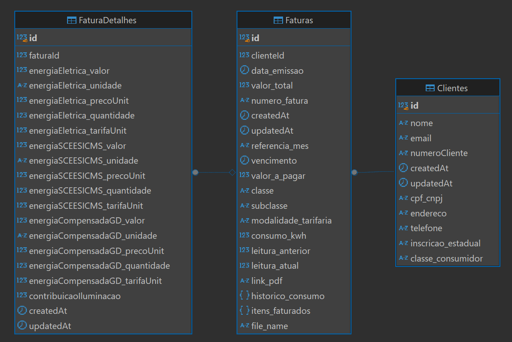

<p align="center">
  
</p>
<p align="center">
    <h1 align="center">LUMI-BACK</h1>
</p>
<p align="center">
    <em><code>❯ Projeto teste seletivo Lumi</code></em>
</p>
<p align="center">
	
	
	
	
</p>
<p align="center">
		<em>feito usando as seguintes tecnologias:</em>
</p>
<p align="center">
	
	
	
	
	
	
	
	
</p>

<br>

#####  Indices

- [Overview](#overview)
- [Features](#features)
- [Repository Structure](#repository-structure)
- [Modules](#modules)
- [Getting Started](#getting-started)
  - [Installation](#installation)
  - [Usage](#usage)
  - [Tests](#tests)
- [Project Roadmap](#project-roadmap)

---

##  Overview

<code>❯ Projeto focado em interpretar faturas em pdf e disponibilizar o os dados</code>

---

##  Features

<code>❯ 
- CRUD simples para cadastrar usuários e faturas
- Parser que interpreta o pdf para salvar a fatura no banco Postgres
- Pagina de Dashboard com graficos que exibe os consumos medios e totais dos clientes totais e individualmente
- Pagina com listagem de clientes e faturas onde é possível ter acesso aos arquivos disponibilizados em um bucket google
</code>

---

##  Repository Structure

```sh
└── lumi-back/
    ├── Dockerfile
    ├── README.md
    ├── api-collection.json
    ├── assets
    │   ├── Faturas
    │   ├── imagem.png
    │   └── sample.txt
    ├── config
    │   ├── config.json
    │   └── jest.config.js
    ├── docker-compose.yml
    ├── migrations
    ├── models
    │   ├── cliente.js
    │   ├── fatura.js
    │   └── index.js
    ├── package-lock.json
    ├── package.json
    ├── pdfParser.js
    ├── routes
    │   ├── cliente.js
    │   ├── fatura.js
    │   └── upload.js
    ├── seeders
    ├── server.js
    ├── tests
    ├── upload
    └── utils
        └── pdfParser.js
```

---

##  Modules

<details closed><summary>.</summary>

| File | Summary |
| --- | --- |
| [api-collection.json](https://github.com/Luan-Ligapi/lumi-back/blob/main/api-collection.json) | <code>❯ Coleção com exemplo de uso de rotas de rotas</code> |
| [server.js](https://github.com/Luan-Ligapi/lumi-back/blob/main/server.js) | <code>❯ Arquivo motor</code> |
| [pdfParser.js](https://github.com/Luan-Ligapi/lumi-back/blob/main/pdfParser.js) | <code>❯ Conversor de pdf para array de strings</code> |

</details>


<details closed><summary>models</summary>

</details>

<details closed><summary>routes</summary>

| File | Summary |
| --- | --- |
| [upload.js](https://github.com/Luan-Ligapi/lumi-back/blob/main/routes/upload.js) | <code>❯ Upload de faturas</code> |
| [cliente.js](https://github.com/Luan-Ligapi/lumi-back/blob/main/routes/cliente.js) | <code>❯ crud clientes</code> |
| [fatura.js](https://github.com/Luan-Ligapi/lumi-back/blob/main/routes/fatura.js) | <code>❯ crud faturas</code> |

</details>

---

##  Getting Started


###  Installation

Build the project from source:

1. Clone the lumi-back repository:
```sh
❯ git clone https://github.com/Luan-Ligapi/lumi-back
```

2. Navigate to the project directory:
```sh
❯ cd lumi-back
```

3. Install the required dependencies:
```sh
❯ npm install
```

###  Usage

To run the project, execute the following command:

```sh
❯ npm start
```

###  Tests

Execute the test suite using the following command:

```sh
❯ npm test
```

---

##  Project Roadmap

- [X] **`Task 1`**: <strike>Protótipo</strike>
- [ ] **`Task 2`**: Ajustar parser para interpretar melhor e com mais dados, tem um bug de conversão em quem usa mais de 1000 kwh/mes.
- [ ] **`Task 3`**: novas rotas, novos graficos, autenticação.

---

